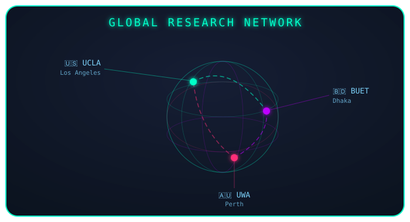
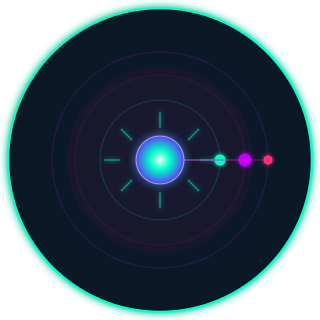

<!-- ═══════════════════════════════════════════════════════════════════════════════ -->
<!--  AL IMRAN · GITHUB PROFILE README  ·  AGENTIC AI / LLM SYSTEMS EDITION        -->
<!-- ═══════════════════════════════════════════════════════════════════════════════ -->

  

 

<!-- AGENTIC AI AVATAR + INTRO -->
<table>
<tr>
<td width="240" align="center">

</td>
<td valign="top">

### `> initializing profile...`

Hi, I'm **Al Imran** — an AI researcher working at the intersection of **large language models, agentic AI systems, and computational oncology**. My work spans building multimodal AI pipelines for medical imaging and radiomics, and increasingly, designing **autonomous, tool-using AI agents** that can reason, plan, and act across multi-step research and clinical workflows.

I care about AI that doesn't just predict — it **reasons, retrieves, and acts**.

</td>
</tr>
</table>

<!-- LIVE TYPING — ROLE / AFFILIATION TICKER -->

 

<!-- LIVE BADGES ROW -->

&nbsp;&nbsp;
&nbsp;&nbsp;
&nbsp;&nbsp;
&nbsp;&nbsp;

 

◈ this line is generated fresh every day by the **Claude API**, running inside a scheduled GitHub Action — not a static string

 

---
## `▸ AGENTIC_AI & LLM_ENGINEERING`

 

**Orchestration & Agent Frameworks**

**LLM APIs & Model Serving**

**RAG, Memory & Retrieval**

**Fine-Tuning, Evals & Ops**

> **Focus areas:** multi-agent orchestration for research automation, retrieval-augmented reasoning over clinical/radiomics data, tool-calling agents for literature synthesis, and explainable LLM pipelines (XAI) for healthcare-grade trust and auditability.

---
## `▸ ORBITAL_TECH_MAP`

 

**Core Intelligence**

**Systems & Languages**

**Cloud & Orchestration**

**Data & Backends**

 

---
## `▸ GLOBAL_RESEARCH_FOOTPRINT`

 

 

&nbsp;&nbsp;
&nbsp;&nbsp;

<i>GitHub markdown strips live iframe embeds, so a real Google Map can't render inline here — the diagram above stands in for it, and each badge links straight to the real campus on Google Maps.</i>

---

## `▸ NEURAL_METRICS  ( GitHub Intelligence )`

 

&nbsp;&nbsp;

 

 

&nbsp;&nbsp;

 

 

<!-- ANIMATED CONTRIBUTION SNAKE (requires a small one-time GitHub Actions setup — see notes below) -->

---
## `▸ OPEN_SOURCE_&_AUTOMATION`

 

&nbsp;&nbsp;
&nbsp;&nbsp;

This profile is more than a static page — the **`AI SIGNAL`** badge above it is a small live agent: a scheduled [GitHub Action](./.github/workflows/ai-signal.yml) calls the **Claude API** once a day via [`scripts/generate_signal.mjs`](./scripts/generate_signal.mjs) and rewrites [`data/signal.json`](./data/signal.json), which the badge reads directly. The whole setup is MIT-licensed and open source — fork it, drop your own `ANTHROPIC_API_KEY` into your repo secrets, and it starts generating its own signal within a day.

---

### `"Not just predicting the future of medicine — building the agents that help discover it."`

 

<!-- ═══════════════════════════════════════════════════════════════ -->
<!-- SEO METADATA                                                    -->
<!--                                                                 -->
<!-- keywords: AL Imran AI scientist, alimran researcher,            -->
<!-- UCLA AI researcher, BUET AI researcher, computational oncology, -->
<!-- agentic AI engineer, LLM systems architect, multimodal AI,      -->
<!-- XAI healthcare, clinical NLP, LLM biomedical, VLM clinical,     -->
<!-- cancer AI prediction, deep learning oncology, radiomics AI,     -->
<!-- multi-omics machine learning, RAG pipelines, autonomous agents  -->
<!-- ═══════════════════════════════════════════════════════════════ -->
